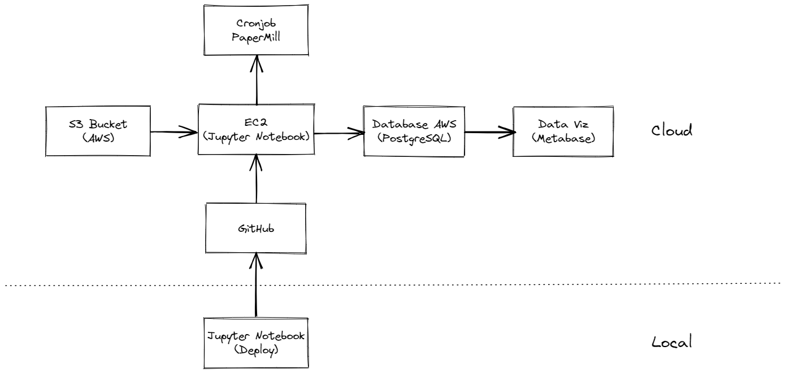

# Insiders Clustering

# 1. Context

The company All in One Place is a Multibrand Outlet company, i.e., it sells second line products of various brands at a lower price, through an e-commerce platform. In 1 year of operation, the marketing team realized that some customers in its base buy more expensive products with high frequency and end up contributing with a significant portion of the company's revenue. Based on this perception, the marketing team will launch a loyalty program for the best customers in the base, called Insiders. But the team does not have an advanced knowledge of data analysis to choose the program participants. For this reason, the marketing team asked the data team to select eligible customers for the program, using advanced data manipulation techniques.

# 2. Business Problem

* What is the context like?

    * A Outlet company realized that some expensive buys from some customers are a significant portion of the company's revenue and wants to retain those customers.

* What is the objective?

    * The marketing team wants to retain those customers by lauching a loyalty program, but does not know who exactly they are.

* Who is the Stakeholder of the problem?

    * The marketing team

* How will the solution be?

    * Elaborate a model to cluster this customer category, get some insigths and return a list of customers who will join the Insiders program.

    * Questions to be answered:

        1. Who are the people eligible to join the Insiders program?
        2. How many customers will be part of the group?
        3. What are the main characteristics of these customers?
        4. What is the percentage of revenue contribution coming from the Insiders?
        5. What is the expected revenue of this group for the next months?
        6. What are the conditions for a person to be eligible to join Insiders?
        7. How can a person be removed from the Insiders program?
        8. What is the guarantee that the Insiders program is better than the rest of the base ?
        9. What actions can the marketing team take to increase revenue?

# 3. Data available

Data is available in: https://www.kaggle.com/vik2012kvs/high-value-customers-identification 

Each row represents a sales transaction, which occurred between the period November 2016 and December 2017.

The dataset includes the following information:

* Invoice Number: unique identifier for each transaction.
* Stock Code Product: code of the item.
* Description Product: the name of the item.
* Quantity: The quantity of each item purchased per transaction.
* Invoice Date: The day the transaction took place.
* Unit Price: The price of the product per unit.
* Customer ID: The customer's unique identifier.
* Country: The name of the country that the customer resides in.

# 4. Business Assumptions

All data was taken from the company's internal sales base between the period November 2016 and December 2017. For this data, some assumptions were made for filling in missing data and filtering:

* If there is no customer_id, the field is filled with a increasing integer ID starting at 19,000.
* It was considered only transactions where the unit_price is higher than 0.04, to avoid outliers.
* Unusual stock_code such as 'POST', 'D', 'DOT', 'M', 'S', 'AMAZONFEE', 'm', 'DCGSSBOY', 'DCGSSGIRL', 'PADS', 'B', 'CRUK' were droped.
* Transactions with country in 'Unspecified', 'European Community' were discarded.
* Negative numbers in quantity field were considered as returns.

# 5. Machine Learning Metrics

Five data spaces were tested to find the most well defined clusters:

* Original
* PCA
* UMAP
* t-SNE
* Tree-based embedding

The following metrics were used to choose the best model:

* Silhouette Score
* Business assumptions

To choose the best data space, the Silhouette Score was used within visual spections when there was just 2 dimensions and the final results obtained on the cluster analysis. In the last cycle, it was decided to use the original data space, because the cluster Insiders created with this space was the best fit for the business problem, as will be shown in the next section.

The models were trained with different values for number of clusters K and its Silhouette Scores were compared to choose the best one and a value for K.

|  Model Name  |     2     |     3     |     4     |     5     |     6     |     7     |     8     |     9     |     10    |    ...    |
|:------------:|:---------:|:---------:|:---------:|:---------:|:---------:|:---------:|:---------:|:---------:|:---------:|:---------:|
| K-Means      |  0.384743 |  0.396820 |  0.408177 |  0.405300 |  0.435058 |  0.440703 |  0.420506 |  0.452052 |  0.480216 |   ...     |
| GMM          |  0.371740 |  0.372828 |  0.327856 |  0.292961 |  0.253373 |  0.390509 |  0.382010 |  0.232109 |  0.439737 |   ...     |
| HC           |  0.382211 |  0.364907 |  0.387069 |  0.381979 |  0.357126 |  0.376975 |  0.385656 |  0.411942 |  0.434628 |   ...     |

It can be seen that there is a tendency to the higher the number of clusters, the higher the Silhouette Score. But there is a limit where to many clusters may no longer help , since it would be extremely difficult to actually identify and embody each of them. It was set to divide the customers into 8 groups, since it has a reasonable Silhouette Score and it is close to RFM groups distribution (10 clusters). The K-Means clustering model was used.

Assuming such points, the 8 clusters' main characteristics were defined:

|cluster|total_customers| perc_customer | gross_revenue | recency_days  | total_products|	frequency   |  	 returns     |
|:-----:|:-------------:|:-------------:|:-------------:|:-------------:|:-------------:|:-------------:|:--------------:|
|    0	|      595	    |   10.447761	|   6316.072824	|   75.517647	|   293.833613	|   0.274207	|   231.477311   |
|    5	|      867	    |   15.223881	|   2686.738985	|   91.723183	|   168.610150	|   0.366643	|   23.935409    |
|    7	|      465	    |   8.165057	|   1875.685871	|   86.529032	|   47.122581	|   0.244613	|   13.311828    |
|    3	|      998	    |   17.524144	|   1824.752685	|   97.438878	|   121.535070	|   0.493835	|   2.567134     |
|    2	|      506	    |   8.884987	|   1061.656976	|   103.169960	|   50.816206	|   0.342350	|   7.213439     |
|    1	|      644	    |   11.308165	|   492.556615	|   118.065217	|   17.465839	|   0.400194	|   2.624224     |
|    4	|      436	    |   7.655838	|   383.362041	|   208.536697	|   25.745413	|   0.972605	|   0.481651     |
|    6	|      1184     |   20.790167	|   255.358505	|   156.086149	|   12.673142	|   0.991740	|   4.467905     |

The cluster number 0, which we called "Insiders" is the main public for the new program.

# 6. Business Performance

Answering the initial business questions with the obtained clusters:

1. Who are the people eligible to join the Insiders program?
    * All the customers inside the cluster 0 (Insiders).
    
2. How many customers will be part of the group?
    * 595 customers will be part of the group.
    
3. What are the main characteristics of these customers?
    * Number of customers: 595 (10.44% of all customers)
    * Mean Gross Revenue: $ 6,316.07
    * Mean Recency: 75.51
    * Mean Total Products: 293.83
    * Mean Frequency: 0.27 purcharses / day
    * Mean Returns: 231.47

4. What is the percentage of revenue contribution coming from the Insiders?
    * Insiders' GMV Contribution: 37.19%

5. What is the expected revenue of this group for the next months?
    * Need to elaborate a time series model

6. What are the conditions for a person to be eligible to join Insiders?
    * The person has to have similar characteristics to the ones described in question 3 to be eligible, focusing on high gross revenue and quantity of products.

7. How can a person be removed from the Insiders program?
    * The person has to have different characteristics to the ones described in question 3.

8. What is the guarantee that the Insiders program is better than the rest of the base?
    * Based on the percentage of revenue contribution and purchase volume, we can see that the Insiders cluster stand out.

9. What actions can the marketing team take to increase revenue?
    * They can focus on the second cluster with the higher gross revenue and stimulate them to buy more or more expensive products, giving discounts or a special service, to put them closer to the insiders.
    * Cross Sell to Insiders cluster.
    
# 7. Deploy

The model was deployed using an AWS EC2 instance running Ubuntu. An Activity was set on Cronjob to execute a bash script that calls the Papermill that executes the Jupyter Notebook containing the model to perform the clusterization. The data comes from a S3 bucket and the output is saved on a PostgreSQL database in the AWS RDS, which can be accessed by the user using to create dashboards and reports, which was made here using Metabase.

